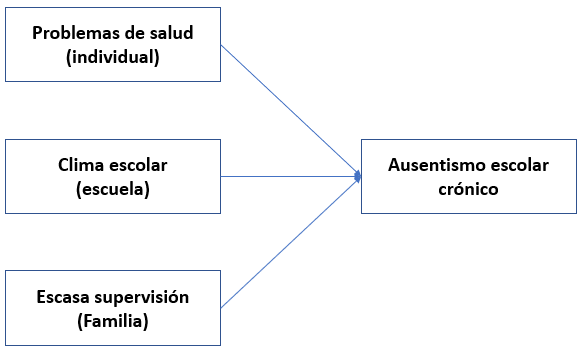
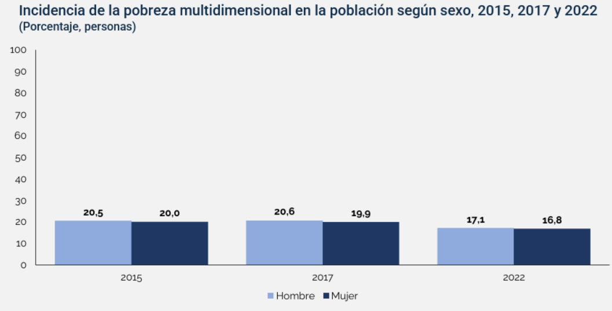
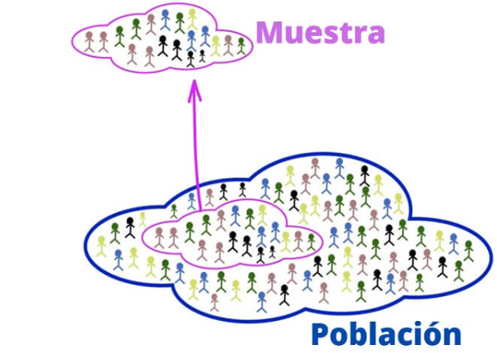
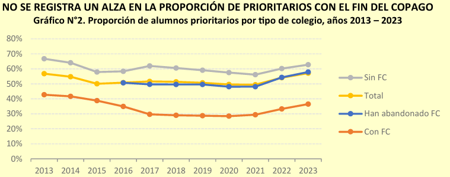
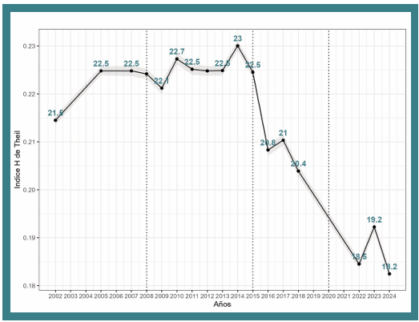
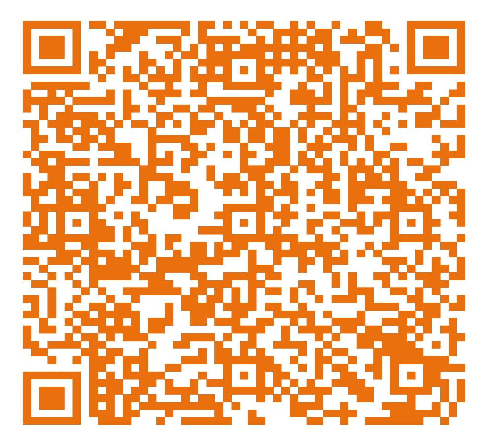

class: inverse, bottom, right

```{r, include=FALSE,echo=FALSE,results='hide'}
#install.packages("pagedown")
#pagedown::chrome_print("Presentacion.html",output="Presentacion.pdf")
```


```{r setup, include=FALSE, cache = FALSE}

library(dplyr)
require("knitr")
options(htmltools.dir.version = FALSE)
pacman::p_load(RefManageR)
 
```

```{r eval=FALSE, echo=FALSE}
# Correr esta linea para ejecutar
rmarkdown::render('xaringan::moon_reader')
```

# __Primera Cátedra: Método Cuantitativo II__
## * Investigar desde una perspectiva Cuantitativa *
<br>
<hr>
# 

### Docente: Francisco Meneses
<br>

---

# Contenido

+ Lo esencial de lo cuantitativo

+ Medir en Ciencias Sociales

+ Qué es modelar

+ Preguntas de investigación
  


---
class: inverse, middle, center, slideInRight

#  ¿Qué es lo propio de la metodología cuantitativa? 
---


## La metodología cuantitativa 

- La medición de la realidad social: Pasamos la realidad a números para analizarla [(Asun, 2006)](https://imaginariosyrepresentaciones.com/wp-content/uploads/2015/08/canales-ceron-manuel-metodologias-de-la-investigacion-social.pdf)
  
--

- Generamos modelos para aprender sobre la realidad

  - ¿Qué es un modelo en ciencia? **¿Qué modelos conocen?**
  - Todos los modelos son erróneos, algunos son útiles [(George Box)]()

--
  
-  Alcances de la investigación [(Hernandez, Fernandez, Baptista, 2014)](https://apiperiodico.jalisco.gob.mx/api/sites/periodicooficial.jalisco.gob.mx/files/metodologia_de_la_investigacion_-_roberto_hernandez_sampieri.pdf)

  -  Exploratorios
  -  Descriptivos 
  -  Correlacionales
  -  Causales 
  
  
---

##  Modelo integrado de inasistencia escolar (Ingul et al., 2012)

.center[



]

* Fórmula matemática ➡️ comprobación empírica
* ¿Qué otras causas podrían haber? 

---


# Utilidades para nuestro quehacer profesional

 >  La metodología cuantitativa nos permite...

* medir el efecto de políticas públicas 

--

* monitorear el desarrollo de las políticas

--

* comprender la magnitud y los cambios de problemas sociales

--

* comprender las causas de problemas sociales y saber cómo abordarlos

--

* comprender moderadores de problemas sociales

--

 >  ¿Qué temas les parecería interesante investigar cuantitativamente?
 
 
---

class: inverse, middle, center, slideInRight

#  Medir en ciencias sociales

---

# Teoría representacional de los números

--

 * Complejidad de medir lo social y psicológico: __Constructos__ 

--

 * No existen unidades de medida ¿Es posible medir entonces? 

--

 *  __Teoría representacional de la medición__ uso pragmático 
 
    > _"Medir es representar relaciones empíricas en relaciones numéricas"_

--

  * ¿Qué pueden representar los números? Niveles de medición.   
  
        + Nominal
        + Ordinal
        + Escalar 
        + De razón
        
  * Son relevantes pues nos ayudan a elegir que técnica estadística utilizar
      
      
      
???

Al igual que en ciencias naturales medimos las causas

---

# Niveles de medición

- **Nominal**  
  🔹 Clasifica en categorías sin orden.  
  🔹 *Ejemplo:* género, tipo de escuela, color de ojos.

- **Ordinal**  
  🔹 Clasifica en categorías con orden, pero sin distancias iguales.  
  🔹 *Ejemplo:* nivel educativo, nivel de satisfacción.

- **Escalar (Intervalo)**  
  🔹 Orden y distancias iguales, pero sin cero absoluto.  
  🔹 *Ejemplo:* temperatura en °C, puntajes en pruebas.

- **De razón**  
  🔹 Igual que el escalar, pero con cero absoluto.  
  🔹 *Ejemplo:* edad, ingresos, número de hijos.

---

# Actividad:

Escriba en su cuaderno un ejemplo de los siguientes niveles de medición

* Nominal

* Ordinal 

* Numérico (escalar o de razón)

---

# Proceso de operacionalización

 * En base a teoría se comprende la definición de un fenómeno 
 
 * Se identifican las dimensiones teóricas 
 
 * Se generan indicadores o formas concretas de medirlo
 
 
---

class: inverse, middle, center, slideInRight

#  ¿Cómo medimos la pobreza? 

---

# La pobreza multidimensional (CASEN, 2013) 

* *La pobreza debe entenderse como una situación de privación de derechos fundamentales que impide a las personas ejercer su ciudadanía y alcanzar un nivel de vida adecuado, conforme a los estándares internacionales de derechos humanos.* **CEPAL (2010)**


???

Faltarian los ítem concretos

---

class: inverse, middle, center, slideInRight

#  ¿Cómo ha cambiado la pobreza multidimensional? 
    (Descripción)

---

# Cambios en la pobreza multidimensional


---

class: inverse, middle, center, slideInRight

#  ¿Cómo se asocia la pobreza multidimensional con el género? 
    (Asociación)

---

# Asociación entre género y pobreza multidimensional




---


# Pero... esto es insuficiente:

 ¿Cómo sabemos si esta relación es significativa o es error muestral? 
 
 ¿Cuál es la fuerza de esta asociación? 
 
 ¿Estamos confundiendo con otros factores que podrían explicar esta relación?
 
 ¿Qué factores explican esta relación?
 
 ¿Qué factores potencian esta asociación? 

---

# Estadística inferencial
 
* Nos permite hablar de la población basándonos en una muestra
 
* Utilizamos intervalos de confianza y pruebas de significación (p<0.05)

.center[

]

---


class: inverse, middle, center, slideInRight

#  El diálogo con la sociedad: Ejemplos

    (Ellos dicen, nosotros decimos)

---

# Ellos dicen

.pull-left[

]

.pull-right[

]

---

# Nosotros decimos

.pull-left[

]

.pull-right[

]


---

# En resumen:
 
 
  - La metodología cuantitativa se basa en la medición y el modelamiento de lo social
 
--
 
  - Medimos lo social desde la teoría representacional y los niveles de medición
 
--
 
  - Utilizamos estadística inferencial para generalizar resultados
 
--
 
  - Esto nos permite entregar evidencia para las políticas públicas


---
class: center

# Ticket de salida





